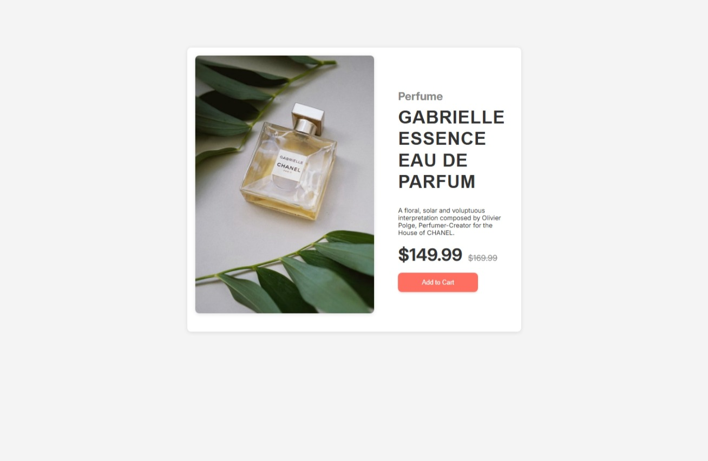

# 💎 Product Preview Card Component

Este é um desafio do [Frontend Mentor](https://www.frontendmentor.io/challenges/product-preview-card-component-GO7UmttRfa) recriado com HTML e CSS puros, com foco em layout responsivo e boas práticas de código.



---

## 🛠 Tecnologias usadas

- HTML5 semântico  
- CSS3 moderno  
- CSS Grid e Flexbox  
- Responsividade com Media Queries  
- Efeitos com `:hover`, `transition` e `:active`

---

## 🎯 Desafio proposto

> Criar um cartão de produto com:
- Layout de **2 colunas no desktop**
- Layout de **1 coluna no mobile (até 780px)**
- Preço original + desconto
- Botão "Add to Cart" com interações visuais

---

## 📱 Responsividade

O layout se adapta perfeitamente a telas pequenas:

- Mobile (≤ 780px): layout em 1 coluna, botões e textos redimensionados
- Desktop: layout em 2 colunas, com imagem e descrição lado a lado

---

## 📸 Resultado

Você pode visualizar o projeto publicado aqui:  
🔗 [**Link no Vercel**](https://product-preview-nine-sandy.vercel.app)  
🔗 [**Desafio original no Frontend Mentor**](https://www.frontendmentor.io/challenges/product-preview-card-component-GO7UmttRfa)

---

## 🧠 O que aprendi

- Criar grids responsivos usando `grid-template-columns`
- Ajustar o layout com `media queries`
- Trabalhar com `object-fit` para imagens
- Criar interações com `:hover` e `:active`
- Organizar CSS modularmente (style.css + responsive.css)

---

## 🚀 Como rodar localmente

```bash
git clone https://github.com/victorSsx/product-preview-card
cd product-preview-card
